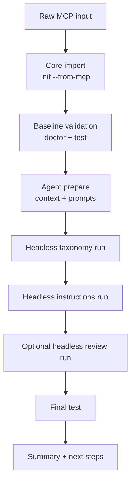

# One-Shot Autopilot Spec

This is the working spec for a one-shot Pluxx flow that imports a raw MCP, uses a host coding agent headlessly, and returns a validated plugin project without making the user chain multiple commands by hand.

## Problem

Today, the pieces exist, but the user has to orchestrate them:

1. `pluxx init --from-mcp`
2. `pluxx agent prepare`
3. `pluxx agent run taxonomy --runner ...`
4. `pluxx agent run instructions --runner ...`
5. `pluxx agent run review --runner ...`
6. `pluxx test`

That is workable for power users, but it is not the clean product surface.

What users will want is:

- bring a raw MCP
- choose the host runner they already use
- let Pluxx do the deterministic work
- let the host agent do the semantic work
- get a tested project back

## Proposed Command

```bash
pluxx autopilot --from-mcp <source> --runner <codex|claude|opencode>
```

Example:

```bash
pluxx autopilot \
  --from-mcp https://mcp.playkit.sh/mcp \
  --runner codex \
  --name playkit \
  --display-name "PlayKit" \
  --targets claude-code,cursor,codex,opencode \
  --grouping workflow \
  --hooks safe \
  --auth-env PLAYKIT_API_KEY \
  --auth-type header \
  --auth-header X-API-Key \
  --auth-template '${value}'
```

## Goal

Turn this:

- raw MCP server

Into this:

- valid Pluxx project
- semantically refined instructions and skills
- tested platform bundles
- readable summary of what was generated and what still needs human review

## Product Model

Autopilot is not a separate engine.

It is a coordinated wrapper around:

- deterministic Core steps
- Agent Mode prompt/context prep
- a host coding agent in headless mode
- final verification

## Flow



## Default Sequence

Autopilot should run:

1. `init --from-mcp`
2. `doctor`
3. `test`
4. `agent prepare`
5. `agent run taxonomy --runner <runner>`
6. `agent run instructions --runner <runner>`
7. optional `agent run review --runner <runner> --no-verify`
8. `test` again
9. print summary

## Why Validate Twice

The first validation answers:

- did the deterministic scaffold work?

The second validation answers:

- did the agent refinement stay inside safe boundaries?

This keeps the semantic layer honest.

## CLI Shape

### Required

- `--from-mcp <source>`
- `--runner <codex|claude|opencode>`

### Common scaffold flags

- `--name`
- `--display-name`
- `--author`
- `--targets`
- `--grouping`
- `--hooks`
- `--transport`
- `--auth-env`
- `--auth-type`
- `--auth-header`
- `--auth-template`

### Context flags

- `--website`
- `--docs`
- `--context <comma-separated files>`

### Control flags

- `--dry-run`
- `--json`
- `--quiet`
- `--yes`
- `--skip-review`
- `--skip-install-checks`

## Output Contract

Autopilot should return:

- project path
- import result
- baseline validation result
- runner used
- semantic passes executed
- final validation result
- key warnings
- generated top-level file tree

### JSON output

Suggested top-level shape:

```json
{
  "ok": true,
  "project": {
    "name": "playkit",
    "path": "./playkit"
  },
  "import": {
    "ok": true,
    "toolCount": 24,
    "skillCount": 8
  },
  "agent": {
    "runner": "codex",
    "steps": ["taxonomy", "instructions", "review"],
    "ok": true
  },
  "verification": {
    "ok": true,
    "doctor": {
      "errors": 0,
      "warnings": 1,
      "infos": 1
    },
    "test": {
      "ok": true,
      "targets": ["claude-code", "cursor", "codex", "opencode"]
    }
  }
}
```

## Guardrails

Autopilot must preserve the existing write-boundary model:

- agent may edit only managed sections
- agent may not rewrite user custom sections
- agent may not edit `dist/`
- agent may not change auth wiring unless explicitly asked

If the agent fails:

- the deterministic scaffold must still remain valid
- the command must surface what failed
- the user should still have a usable project

## Dry Run Behavior

`--dry-run` should show:

- planned import
- planned agent passes
- files that would be created
- files that may be updated
- target platforms
- host runner command that would be executed

It must not:

- write files
- invoke the runner
- build or install anything

## Human Review Points

Autopilot should still call out:

- hook trust requirements
- auth env requirements
- platform-specific limitations
- weak semantic groupings the review step flags

This prevents the feature from feeling like opaque magic.

## MVP

Phase 1:

- run inside the current working directory
- require explicit `--yes` in non-interactive mode
- support `codex`, `claude`, `opencode`
- run taxonomy + instructions by default
- optional review pass
- final `pluxx test`

Phase 2:

- support `--output-dir`
- support `--install`
- support project-level prompt overrides
- support resumable autopilot runs

## Acceptance Criteria

- One command can take a raw MCP and produce a tested plugin project
- The host runner is explicit and reproducible
- Failure modes are readable
- Managed/custom boundaries remain intact
- The resulting project is no worse than running the current manual sequence

## Open Questions

- Should the command name be `autopilot`, `one-shot`, or `agent run all`?
- Should review run by default or only when requested?
- Should install ever be part of autopilot, or stay explicit?
- Should autopilot create a new directory automatically when `--name` is provided?
