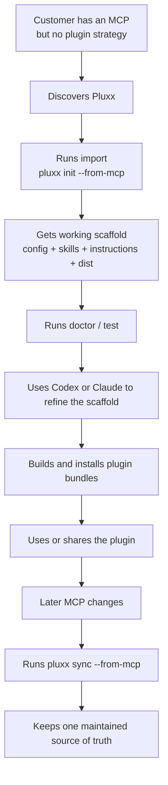

# Pluxx Customer Journey

This document is the working customer journey for Pluxx. It is meant to be iterated on as positioning and onboarding get sharper.

## One-Line Story

A customer brings an MCP server to Pluxx, gets a valid multi-platform plugin project immediately, lets Codex or Claude refine it safely, validates it, ships it, and keeps it in sync from one source of truth as the MCP evolves.

## Journey Diagram



## Stage 1: Before Pluxx

The customer usually starts with a problem, not with a desire for a CLI.

Typical starting point:

- "We launched an MCP."
- "We want this to work in Codex, Claude Code, Cursor, and OpenCode."
- "We do not want to maintain four plugin formats."
- "We want AI help, but we do not want a mess."

What they have:

- a raw MCP endpoint or stdio command
- maybe docs and a website
- maybe no plugin artifacts at all

## Stage 2: Discovery

The customer understands the promise:

- bring your MCP
- get a working plugin project
- refine it with the coding agent you already use
- maintain it from one repo

The product click is not "plugin compiler."

The click is:

- "this gives my MCP a real distribution and maintenance layer"

## Stage 3: First Run

Example:

```bash
npx @orchid-labs/pluxx init \
  --from-mcp https://example.com/mcp \
  --yes \
  --name acme \
  --display-name "Acme" \
  --targets claude-code,cursor,codex,opencode \
  --grouping workflow \
  --hooks safe
```

What Pluxx does:

- introspects the MCP
- detects transport and auth
- generates a plugin source project
- generates initial workflow skills
- generates platform bundles

What Pluxx does not do:

- deploy or host the MCP backend service itself
- run production MCP infrastructure for the customer

## Stage 4: Immediate Output

The customer now has something concrete:

```text
acme/
├── pluxx.config.ts
├── INSTRUCTIONS.md
├── .pluxx/mcp.json
├── scripts/
├── skills/
└── dist/
```

What they get emotionally at this point:

- "This is real."
- "I did not have to hand-author four plugin formats."

## Stage 5: Trust Check

The customer validates the project:

```bash
npx @orchid-labs/pluxx doctor
npx @orchid-labs/pluxx test --target claude-code cursor codex opencode
```

What they get:

- whether the config is valid
- whether the scaffold is healthy
- whether builds work
- what warnings still exist
- whether trust or auth steps remain

This is the first major trust moment.

## Stage 6: Semantic Refinement

For simple MCPs, the first scaffold may be good enough.

For richer MCPs, the user wants:

- better skill grouping
- stronger examples
- product-faithful instructions
- setup/admin/workflow distinctions

This is where Agent Mode enters:

```bash
npx @orchid-labs/pluxx autopilot --from-mcp https://example.com/mcp --runner codex --yes --name acme --display-name "Acme" --author "Acme"
```

Or step through the refinement passes manually:

```bash
npx @orchid-labs/pluxx agent prepare
npx @orchid-labs/pluxx agent run taxonomy --runner codex
npx @orchid-labs/pluxx agent run instructions --runner codex
```

What happens:

- Pluxx prepares context and prompt packs
- Codex or Claude improves only managed sections
- custom notes remain preserved

## Stage 7: Editing Model

The customer has a clean editing story:

- durable custom edits go in `custom` blocks inside `INSTRUCTIONS.md` and `skills/*/SKILL.md`
- generated blocks can be refreshed by Pluxx or an agent
- sync preserves curated notes

This prevents the common "AI rewrote everything" failure mode.

## Stage 8: Build And Install

Once satisfied:

```bash
npx @orchid-labs/pluxx build
npx @orchid-labs/pluxx install --trust
```

What they get:

- installable Claude Code plugin
- installable Codex plugin
- installable Cursor plugin
- installable OpenCode plugin

This is the "my MCP is actually usable across tools" moment.

## Stage 9: Share Or Ship

The customer can now:

- use it privately
- share it with teammates
- put it in a public repo
- treat it as the canonical plugin project for that MCP

Typical shipping pattern:

1. Commit/version the generated plugin source repo.
2. Build bundles from that source with `pluxx build`.
3. Publish/share bundles through the team's chosen channels.

Pluxx becomes the maintenance repo, not just a one-time generator.

## Stage 10: Ongoing Maintenance

The MCP changes later:

- new tools
- removed tools
- changed auth
- changed docs

The customer runs:

```bash
npx @orchid-labs/pluxx sync --from-mcp https://mcp.example.com/mcp
```

What Pluxx does:

- refreshes managed content
- preserves custom content
- updates the project without resetting it

Then the customer can rerun:

```bash
npx @orchid-labs/pluxx agent run taxonomy --runner codex
npx @orchid-labs/pluxx test
```

## What The Customer Ultimately Gets

Not just generated files.

They get:

- one source of truth for plugin authoring
- a deterministic import/build/test/sync loop
- safe AI-assisted refinement through the tools they already use
- installable plugin bundles across the core four
- a maintainable path as the MCP evolves

## PlayKit Example

For a product like PlayKit, the journey looks like:

1. Bring `https://mcp.playkit.sh/mcp`
2. Pluxx scaffolds the plugin project
3. Codex refines the taxonomy and instructions
4. Pluxx builds Claude/Cursor/Codex/OpenCode bundles
5. The team keeps updating that single repo as PlayKit changes

## Open Questions

- When should users reach for `pluxx autopilot` versus the manual Agent Mode steps?
- How much of Agent Mode should be exposed as simple presets for non-technical users?
