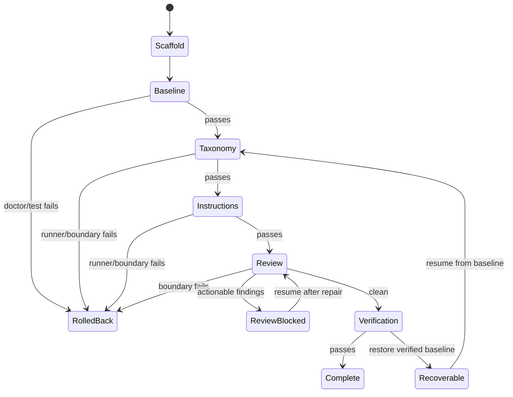

# Fix Autopilot and Agent Mode reliability

## Goal Capsule

Make Autopilot fail-safe around every agent mutation: prove the deterministic scaffold before agents run, checkpoint recoverable state, stop dependent passes after failure, reject unauthorized edits, persist review output, and distinguish baseline failures from post-agent failures. Keep the existing quick, standard, and thorough workload decisions intact.

## Problem Frame

`src/cli/index.ts` currently applies a scaffold and immediately starts agent passes. It runs later passes after a runner failure, verifies only after all mutations, and reports review success from the process exit code. `src/cli/agent.ts` writes an explicit edit plan but does not compare the workspace before and after the runner, so protected files, custom regions, auth wiring, and `dist/` can still be changed.

## Scope Boundaries

In scope: project-local checkpoints and restoration, resumable pass state, baseline doctor/test, fail-stop pass sequencing, enforced Agent Mode file/managed-region boundaries, structured runner/review artifacts, and targeted CLI/docs updates.

Out of scope: changing runner permissions outside Pluxx, adding a hosted review service, redesigning MCP import, or changing the quick/standard/thorough pass-selection policy.

## Requirements

- R1. Run doctor and tests after deterministic scaffold creation and before any agent mutation; report baseline failures separately from post-agent verification failures.
- R2. Stop instructions, review, verification, install, and behavioral work after a required predecessor fails.
- R3. Preserve a durable project checkpoint and pass checkpoints so a failed or unauthorized mutation restores the previous valid state and a rerun can resume completed passes.
- R4. Enforce the generated Agent Mode plan: taxonomy may update its declared file, MCP-derived content may change only declared managed regions, review is read-only, and protected/generated/dist/auth surfaces cannot change.
- R5. Persist runner output and structured review findings in JSON, expose them in JSON and text summaries, and fail the review gate when actionable findings remain.
- R6. Preserve tested quick, standard, and thorough pass behavior.

## Key Technical Decisions

- KTD1. Use durable project checkpoints under `.pluxx/checkpoints/`, excluding repository metadata, dependency caches, ignored/private paths, and the checkpoint store itself. A separate short-lived enforcement snapshot includes protected build output so unauthorized `dist/` mutations can be restored exactly. Manifests reject path and symlink escapes, checkpoint storage is ignored by version control, and file payloads remain private to the current user.
- KTD2. Enforce boundaries around `runAgentPlan`, after Pluxx writes its own context/prompt files and before any deterministic taxonomy refresh. The generic plan is an upper bound: taxonomy may change only its declared taxonomy file, instructions only its configured managed region, and review may change nothing. This detects and restores accidental or cooperative-runner drift; it is not an OS sandbox against a hostile process with the same permissions.
- KTD3. Compare managed files by preserving all text outside declared marker pairs. Missing or malformed markers make the edit unauthorized. Manual projects remain review-only because they have no declared managed regions.
- KTD4. Persist Autopilot state only after a successful baseline or pass. Recovery modes branch before ordinary network setup: `--rollback` needs only local state and restores the initial checkpoint; `--resume` validates a versioned fingerprint of the saved workspace and all behavior-affecting inputs before skipping scaffold application and recorded successful passes. A mismatch restarts from the earliest invalid stage.
- KTD5. Review runners must emit human-readable output plus one uniquely framed, size-bounded, schema-validated JSON object. Pluxx stores bounded diagnostic text and normalized findings; missing, duplicate, oversized, or malformed structured output is `review-inconclusive` and blocks dependent work.

## High-Level Technical Design

## Implementation Units

### U1. Durable workspace checkpoints

**Goal:** Capture and restore a project without touching `.git`, dependencies, build output, or checkpoint storage.

**Requirements:** R3.

**Files:** `src/cli/checkpoints.ts`, `tests/checkpoints.test.ts`.

**Approach:** Store a versioned manifest plus copied file payloads, restore recorded files byte-for-byte, remove files created after capture, reject path and symlink escapes, and expose separate durable and enforcement snapshots. Durable snapshots omit ignored/private paths; enforcement snapshots include protected project output required for exact restoration.

**Test scenarios:** Existing files restore after modification; newly created files disappear; deleted files return; excluded paths survive untouched; invalid or escaping manifest paths are rejected.

### U2. Enforced Agent Mode boundaries and review artifacts

**Goal:** Enforce the declared mutation contract for ordinary headless runners and restore accidental out-of-bounds edits.

**Requirements:** R4, R5.

**Dependencies:** U1.

**Files:** `src/cli/agent.ts`, `tests/agent-mode.test.ts`.

**Approach:** Snapshot immediately before the runner, capture bounded stdout/stderr/final response, apply a kind-specific allowlist beneath the generic plan, restore on runner or boundary failure, validate managed regions, and persist normalized review results after a successful read-only review. Fail the gate when the structured payload is absent or invalid.

**Test scenarios:** Allowed taxonomy and managed-block edits persist; custom-region, undeclared, `dist/`, config/auth, generated-file, and manual-project edits fail and restore; runner failure restores all mutations; structured and plain review outputs are captured.

### U3. Transactional, resumable Autopilot orchestration

**Goal:** Turn the pass sequence into a fail-stop state machine with baseline proof and recovery.

**Requirements:** R1, R2, R3, R5, R6.

**Dependencies:** U1, U2.

**Files:** `src/cli/index.ts`, `tests/autopilot.test.ts`.

**Approach:** Branch recovery flags before ordinary network/scaffold setup. Create an initial checkpoint before scaffold mutation, run doctor/test baseline, persist successful stages and their input/workspace fingerprints, run only the next eligible pass, gate on boundary/review results, restore the immediately preceding valid stage on failure, and report baseline/post-agent status distinctly.

**Test scenarios:** Baseline failure runs no agents; taxonomy failure skips instructions/review/verification; instructions failure skips review; actionable review findings fail the gate; unauthorized mutations restore; final verification failure restores the baseline; resume skips successful passes without the original MCP; rollback removes current recovery artifacts while preserving pre-existing diagnostics; stale-lock recovery admits one writer; quick/standard/thorough decisions remain unchanged.

### U4. Product and operator documentation

**Goal:** Make recovery and enforcement behavior part of current product truth.

**Requirements:** R1-R6.

**Dependencies:** U1-U3.

**Files:** `docs/autopilot-spec.md`, `docs/agent-mode.md`, `docs/todo/queue.md`, `docs/todo/master-backlog.md`, `docs/roadmap.md`.

**Approach:** Document baseline/post-agent distinction, checkpoint/resume/rollback commands, review artifact paths, enforced manual-project read-only behavior, and current shipped status without changing broader roadmap priorities.

**Test expectation:** Documentation consistency review and CLI help assertions in existing tests.

## Verification Contract

- Targeted Agent Mode, Autopilot, and checkpoint suites cover all named failure modes.
- Typecheck and build pass.
- The official serial `npm test` passes in full.
- CE code review plus a reliability/security-focused diff review finds no unresolved actionable issue.
- The PR links PLUXX-314/GitHub #404 and carries `ai:autofix-enabled`.

## Definition of Done

Every PLUXX-314 acceptance criterion is enforced by code and regression tests; failures restore the last valid workspace state and stop dependent work; review findings are visible in text/JSON; docs and Linear reflect the implementation; the focused PR is green and mergeable but not merged.
