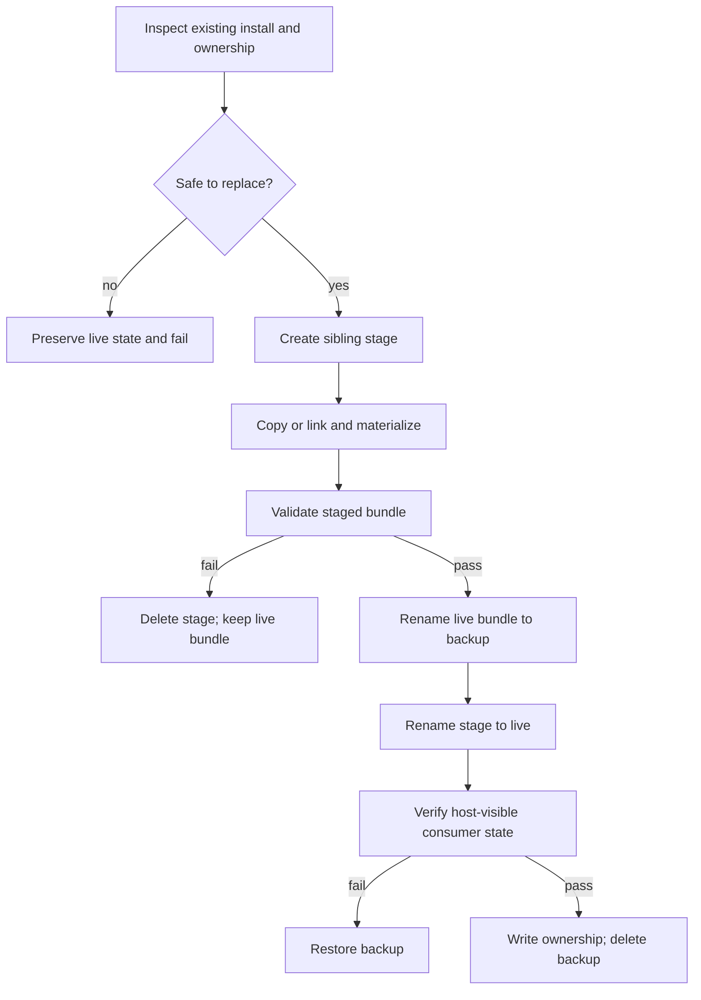

# PLUXX-319 Transactional installs and universal ownership

## Goal Capsule

- **Objective:** Make core-four installs recoverable, ownership-aware, content-verifiable, and conservative when users modify installed files or Codex config.
- **Authority:** Linear PLUXX-319 acceptance criteria, repo `AGENTS.md`, then existing install and Codex companion contracts.
- **Execution profile:** Reliability and supply-chain hardening on `codex/pluxx-319-transactional-installs` in the visible task worktree.
- **Stop conditions:** Do not delete or overwrite an unowned or modified file; restore the previous bundle when staging, replacement, or post-install verification fails.
- **Tail ownership:** Run targeted lifecycle tests, build, typecheck, full serial `npm test`, CE review with security/reliability lenses, then PR and CI closeout without merging.

---

## Product Contract

### Summary

Pluxx will stage and validate core-four local installs before swapping them into host-visible paths, record hashes for owned files and config mutations, preserve user modifications during reinstall and uninstall, and treat same-version content drift as a verification failure.

### Problem Frame

Current copied installs delete the live directory before copying the replacement, so a failed copy or materialization can destroy a working install. Uninstall removes complete directories without knowing which files still match Pluxx output. Codex companion apply merges hook and MCP approval settings without an ownership record or inverse operation. Non-Codex verification usually compares only versions, allowing same-version content drift to pass.

### Requirements

**Transactional bundle lifecycle**

- R1. A local core-four install must stage and validate the candidate before replacing the live bundle.
- R2. Replacement must retain a recoverable sibling backup until post-install verification succeeds and must restore it on failure.
- R3. Reinstall must refuse to overwrite unowned or user-modified installed content.

**Ownership lifecycle**

- R4. Pluxx must record hashes and paths for installed files and host-adjacent mutations it owns.
- R5. Uninstall and prune behavior must delete only content whose current hash still matches its ownership record and preserve modified or unowned content.
- R6. Ownership records and mutation paths must reject traversal, malformed hashes, and plugin/platform identity mismatches.

**Codex config lifecycle**

- R7. Codex apply must record the exact hook and MCP approval additions it owns without claiming pre-existing settings.
- R8. Codex unapply must be idempotent, remove only unchanged Pluxx-owned additions, and preserve unrelated or user-modified config.

**Verification**

- R9. `verify-install` must distinguish version equality from content equality for copied core-four installs.
- R10. Generated core-four release installers must use the same stage, backup, rollback, ownership, and modification-preservation contract.

### Acceptance Examples

- AE1. Given a working copied bundle, when candidate validation throws, the old bundle remains at the live path and no ownership record advances.
- AE2. Given a working bundle, when post-swap verification throws, the candidate is removed and the backup is restored atomically.
- AE3. Given an owned file edited by a user, reinstall and uninstall preserve it and report the preservation instead of silently deleting it.
- AE4. Given equal manifest versions but different copied bytes, `verify-install` reports content drift.
- AE5. Given Codex config with unrelated edits after apply, unapply removes unchanged marked Pluxx additions and leaves unrelated edits byte-for-byte intact.
- AE6. Given a Pluxx-added Codex line that the user changes, unapply preserves it and reports that it is no longer safely owned.

### Scope Boundaries

- In scope: local CLI installs, generated GitHub Release installers, core-four bundle paths and host-adjacent files, Codex hook/MCP config apply/unapply, verification and docs.
- Out of scope: publish recovery owned by PLUXX-320, new host generators, remote trust/distribution services, and migration of arbitrary legacy host installs that lack enough evidence to claim ownership safely.

---

## Planning Contract

### Key Technical Decisions

- KTD1. Store a versioned per-plugin/per-platform ownership ledger outside the installed bundle so replacement cannot erase the evidence needed for conservative reinstall and uninstall.
- KTD2. Hash deterministic relative paths, file bytes, and symlink targets; exclude transaction scratch paths and the external ledger itself.
- KTD3. Use sibling stage and backup paths plus same-filesystem rename for the commit point. Candidate materialization and integrity checks run against the stage path.
- KTD4. Treat an existing copied bundle without a valid ownership record as unowned. Refuse destructive replacement rather than silently adopting or deleting unknown content.
- KTD5. Remove owned files individually during uninstall, then prune only empty owned directories. A preserved file keeps its directory and the residual ownership evidence needed for later diagnosis.
- KTD6. Mark Codex config additions with stable Pluxx ownership comments and ledger the exact normalized additions. Unapply matches those markers and expected values instead of restoring a whole-file snapshot.
- KTD7. Reuse the same content-signature algorithm in install ownership and `verify-install` so equality has one definition.
- KTD8. Embed equivalent transaction and ownership helpers into generated shell installers because release consumers do not necessarily have the Pluxx CLI installed.

### High-Level Technical Design

### Sequencing

1. Build and test the shared ownership/signature and transaction primitive.
2. Integrate local core-four install and uninstall paths, including host-adjacent files.
3. Add Codex config apply ownership and unapply.
4. Extend verification and generated release installers.
5. Update product truth and run the complete validation/review/PR lifecycle.

### Risks and Mitigations

- Cross-platform rename semantics: keep stage and backup siblings on the same filesystem and restore in a guarded failure path.
- Legacy installs lack ownership: fail safely with an actionable move/remove instruction rather than guessing.
- Ownership ledger tampering: validate schema, identities, relative paths, root containment, and SHA-256 format before mutation.
- Generated shell drift: test generated scripts by executing fixture installs and failure/reinstall cases, not only string snapshots.
- Codex TOML formatting variants: own only generated marker/value pairs and preserve anything not matched exactly.

---

## Implementation Units

### U1. Shared install ownership and transaction primitive

- **Goal:** Provide deterministic bundle signatures, validated ownership records, conservative diffing/removal, and rollback-safe stage/swap operations.
- **Requirements:** R1-R6, R9; AE1-AE4.
- **Files:** `src/install-ownership.ts`, `tests/install-ownership.test.ts`.
- **Patterns:** Follow path validation and hash ownership patterns in `src/codex-agent-install.ts`; keep filesystem mutations injectable enough to prove rollback failures.
- **Test Scenarios:** fresh install; owned unchanged reinstall; modified file; extra unowned file; malformed/traversal ledger; stage failure; post-swap failure; successful backup cleanup; symlink target ownership.
- **Verification:** Targeted ownership tests pass under Vitest.

### U2. Local core-four install and uninstall integration

- **Goal:** Route CLI install paths through the transaction primitive and make uninstall remove only still-owned content.
- **Requirements:** R1-R6; AE1-AE3.
- **Files:** `src/cli/install.ts`, `tests/install.test.ts`, `tests/distribution-lifecycle.test.ts`.
- **Patterns:** Preserve native Claude command behavior while transactionally preparing Pluxx-managed marketplace content; include OpenCode wrapper/skills and Codex marketplace/cache/agent sequencing in rollback boundaries where Pluxx mutates them.
- **Test Scenarios:** all four hosts install; replacement failure restores prior bundle; unowned legacy copy refusal; edited file preservation on reinstall/uninstall; idempotent reinstall/uninstall; user config materialization validated before commit.
- **Verification:** Install and distribution lifecycle suites pass serially.

### U3. Codex config ownership and conservative unapply

- **Goal:** Ledger Pluxx-added hook/MCP settings and expose an idempotent `pluxx codex unapply` command.
- **Requirements:** R4, R6-R8; AE5-AE6.
- **Files:** `src/cli/codex-apply.ts`, `src/cli/index.ts`, `src/index.ts`, `tests/codex-apply.test.ts`, `tests/meta-cli.test.ts`.
- **Patterns:** Reuse Codex agent ownership validation; do not claim pre-existing approved settings; write config and ledger atomically with rollback on either write failure.
- **Test Scenarios:** apply twice; unapply twice; unrelated edits preserved; user-changed owned value preserved; malformed ledger rejected; hooks-only and approvals-only ownership; dry-run and JSON output.
- **Verification:** Codex apply and CLI suites pass.

### U4. Content-aware install verification

- **Goal:** Report copied-bundle content drift even when versions match and surface ownership problems distinctly.
- **Requirements:** R4, R9; AE4.
- **Files:** `src/cli/verify-install.ts`, `tests/verify-install.test.ts`.
- **Patterns:** Reuse the shared signature rather than maintaining a second traversal implementation; retain Codex active-cache diagnostics as an additional layer.
- **Test Scenarios:** same version/same bytes passes; same version/different bytes fails for Cursor, Claude, Codex, and OpenCode copied installs; symlink target mismatch remains precise; missing or invalid ownership is actionable.
- **Verification:** Verify-install suite passes.

### U5. Generated release installer parity

- **Goal:** Make generated core-four shell installers transactional and ownership-aware without requiring an installed Pluxx CLI.
- **Requirements:** R1-R6, R10; AE1-AE3.
- **Files:** `src/cli/publish.ts`, `tests/publish.test.ts`, `tests/release-workflow.test.ts`.
- **Patterns:** Generate one shared shell helper block consumed by each core-four template; preserve current config prompts, runtime bootstrap, marketplace, and agent registration ordering.
- **Test Scenarios:** successful fresh install; failed extraction/materialization leaves old bundle; successful update cleans backup; edited installed file blocks replacement; ownership ledger hashes installed output; repeat install is idempotent.
- **Verification:** Publish and release workflow suites pass.

### U6. Product truth and closeout

- **Goal:** Align public planning/docs and Linear with shipped behavior and validation evidence.
- **Requirements:** R1-R10.
- **Files:** `docs/start-here.md`, `docs/todo/queue.md`, `docs/todo/master-backlog.md`, `docs/roadmap.md`, and narrower lifecycle docs if their claims change.
- **Test Scenarios:** Doc Links relationships remain aligned; no stale claim says ownership is only a follow-on; proof statements cite current validation only.
- **Verification:** Documentation review plus final diff review.

---

## Verification Contract

| Gate | Command | Proves |
|---|---|---|
| Shared mechanics | `npx vitest run tests/install-ownership.test.ts tests/install.test.ts tests/codex-apply.test.ts tests/verify-install.test.ts` | Transaction, ownership, config inverse, and content drift |
| Distribution | `npx vitest run tests/distribution-lifecycle.test.ts tests/publish.test.ts tests/release-workflow.test.ts` | Core-four and generated-installer lifecycle |
| Type safety | `npm run typecheck` | Public and internal contracts compile |
| Build | `npm run build` | Published CLI/package builds |
| Official full suite | `npm test` | Current repository regression baseline, run serially in this worktree |
| Review | CE code review with security, reliability, adversarial, and supply-chain lenses | Unsafe mutation, rollback, traversal, and lifecycle gaps |

Do not run fixture-heavy suites concurrently in this worktree. Any validation count reported in closeout must come from this branch after the final fixes.

---

## Definition of Done

- Every R-ID is implemented and covered by a named test scenario.
- A failed install cannot displace the previous working bundle.
- Reinstall and uninstall preserve modified or unowned user content.
- Codex apply/unapply is idempotent and leaves unrelated config intact.
- Verification fails on same-version content drift.
- Generated core-four installers implement the same safety contract as local CLI installs.
- Build, typecheck, targeted suites, and the full official `npm test` pass serially after final review fixes.
- Repo docs and PLUXX-319/PLUXX-312 Linear truth are updated with current evidence.
- The focused PR links PLUXX-319 and GitHub issue #409, carries `ai:autofix-enabled`, and has no unresolved actionable CI or review feedback.
- Experimental or abandoned code is removed from the final diff.
