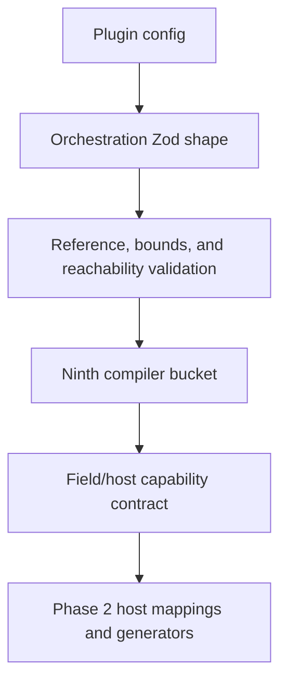
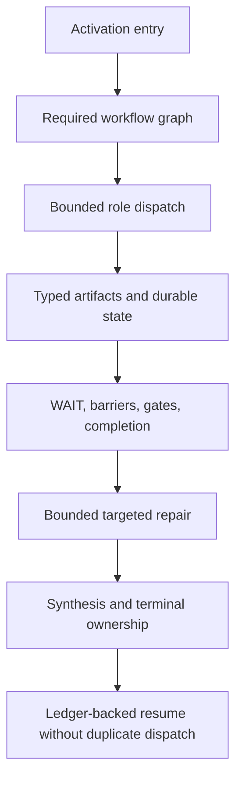

# PLUXX-325 Canonical Orchestration Contract - Plan

## Goal Capsule

Implement the optional ninth canonical compiler bucket as a host-neutral TypeScript/Zod contract with actionable semantic validation and a compiler-owned capability-registry contract. Preserve every project without `orchestration`. Host generators, host-mapping population, installed behavior, and runtime-parity claims remain out of scope.

---

## Product Contract

### Requirements

**Canonical IR**

- R1. Add optional `orchestration` config and exported types for activation/routing, workflow graphs, role bindings and generic dispatch, bounded context, typed artifact/state flow, ownership/barriers/WAIT, gates/completion/repair/resume/synthesis, cleanup/cancellation/fallback, host-neutral proof requirements, child-environment requirements, inheritance/override, delegation bounds, and lifecycle re-entry/idempotency.
- R2. Keep canonical field names, capability identifiers, fixtures, and credential requirements host-neutral. Credential intent uses a closed availability-class plus constrained reference contract; values, defaults, material, headers, arbitrary metadata, and secret-bearing diagnostics must be structurally unrepresentable.
- R3. Keep lifecycle re-injection/idempotency separate from durable workflow resume and duplicate-dispatch prevention.

**Validation and compatibility**

- R4. Reject duplicate or dangling role, node, edge, context, artifact, state, gate, completion, repair, resume, and synthesis references with exact actionable paths.
- R5. Reject unreachable required roles/nodes, entrypoints without completion paths, ownership/barrier contradictions, and unbounded delegation, concurrency, retry, or repair semantics.
- R6. Preserve existing TypeScript, JavaScript, JSON, and maintained canonical project behavior when `orchestration` is absent.

**Compiler capability truth**

- R7. Define stable orchestration field identifiers and require every declared field/host outcome to contain one of `preserve`, `translate`, `degrade`, or `drop`, a named mechanism, activation requirement, enforcement level, effective child-environment outcome, and an existing Pluxx proof tier.
- R8. Keep absent Phase 2 host mappings explicit and unmapped instead of fabricating blanket host outcomes or wiring generators.

**Reference proof and documentation**

- R9. Add bounded host-neutral CE, Hyperframes, and Superpowers fixtures proving generic dispatch/synthesis, typed artifact ownership/barrier/WAIT/repair, and activation/resume/review-repair semantics.
- R10. Update compiler/product docs and Linear to distinguish shipped IR/schema/registry-contract truth from unshipped generation and runtime parity.

### Scope Boundaries

- Host generators, payload emission, installer/runtime behavior, new targets, and live host proof are deferred to Phase 2 and later.
- All-11 host mapping population is deferred; PLUXX-325 ships the enforceable registry shape only.
- Filesystem discovery/import of upstream role assets is not added here; canonical graph references and configured cross-bucket identifiers are validated.

---

## Planning Contract

### Key Technical Decisions

- KTD1. Isolate orchestration schemas and semantic validation in `src/orchestration.ts`; `src/schema.ts` only composes the optional bucket, cross-bucket checks, bucket derivation, and public compiler shape.
- KTD2. Use discriminated graph-node schemas plus a whole-orchestration semantic pass. Local shape/bounds fail at the field; graph/reference/reachability failures attach the precise offending reference path.
- KTD3. Model role inventory independently from reachability. Required roles must be reachable; optional historical/orphan roles remain valid and reportable.
- KTD4. Reuse `ProofTierSchema` from `src/proof-freshness.ts`. Unit fixtures can prove the contract but cannot imply bundle, installed, or real-host behavior.
- KTD5. Store registry rows as declared `(field, platform)` outcomes. Validate duplicate rows and required metadata without requiring every current host to have rows in Phase 1.
- KTD6. Split the canonical bucket taxonomy from implemented host mappings with a distinct `unmapped` lookup result outside the four translation outcomes. Matrix, lint, and primitive-summary consumers render `unmapped` explicitly and never default a missing mapping to `preserve`.
- KTD7. Child-environment declarations are constraints, not grants. Inheritance is the default; any explicit override requires a declared authorization gate, cannot reset delegation/concurrency/retry/repair budgets, and cannot silently weaken sandbox or credential-availability requirements.

### Canonical Shape

| Facet | Stable shape | Semantic contract |
|---|---|---|
| Activation | Ordered entries with `id`, trigger kind, workflow and entry-node references, guarantee, authorization, conditions, and lifecycle re-entry/idempotency policy | Entry references resolve; lifecycle re-injection is bounded and idempotent |
| Workflows | `id`, mode, nodes, directed edges, required gates, completion owners, cancellation/fallback policy, and proof requirements | IDs are unique; required nodes and gates are reachable; every entry reaches completion without bypassing mandatory gates |
| Nodes | Discriminated dispatch, gate, barrier, wait, repair, synthesis, and completion nodes | Each node kind validates only its own references and bounds; repair cycles remain explicitly bounded |
| Roles | `id`, prompt-asset reference, generic or standalone binding, required flag, model tier, and input/output contract | Required roles are reachable; optional orphans remain valid and are returned by a public orphan-report helper |
| Context | Named packets of typed artifact/state/instruction inputs plus positive item and byte limits | Every source resolves and every dispatch packet is bounded |
| Artifact/state | Typed artifacts and state with producer/consumer references, durability, ownership, cleanup, ledger/checkpoint, and completion authority | Producer/consumer edges agree with graph reachability; exclusive ownership cannot conflict; resume prevents duplicate dispatch |
| Child environment | Per-dimension inherit/override constraints for capability, MCP, permission/approval, sandbox, credential availability, and delegation budgets | Overrides require an authorization gate and budgets are monotonic |
| Registry | Declared `(field, platform)` rows with translation mode, mechanism, activation requirement, enforcement, child-environment result, proof tier, and notes | Rows are unique and complete; absent rows remain `unmapped` |

### High-Level Technical Design

---

## Implementation Units

### U1. Prove the canonical IR and semantic failures

- **Goal:** Establish failing tests for the three reference fixtures, legacy compatibility, strict credential intent, exact-path reference failures, reachability, completion paths, and numeric bounds.
- **Requirements:** R1-R6, R9
- **Dependencies:** None
- **Files:** `tests/orchestration.test.ts`, `tests/schema.test.ts`, `tests/config-load.test.ts`, `test-fixtures/orchestration-fixtures.ts`
- **Approach:** Add typed fixtures and invalid mutations before production code. Cover happy paths, boundary values, dangling references, unreachable required nodes/roles, invalid completion/repair/cancellation/fallback paths, ownership conflicts, orphan reporting, proof requirements, privilege-escalating overrides, nested unknown credential fields, and secret-safe diagnostics.
- **Execution note:** Start with focused failing tests and capture the expected red failures before implementing schemas.
- **Patterns to follow:** `tests/schema.test.ts`, `tests/fixtures/compound-engineering-3.19.0/README.md`, `src/schema.ts` issue-path conventions.
- **Verification:** Focused tests fail on the absent orchestration contract for the intended reasons, then pass after U2.

### U2. Implement the orchestration schema and ninth bucket

- **Goal:** Add the host-neutral IR, semantic validator, optional config field, cross-bucket reference checks, compiler bucket mapping, and public exports.
- **Requirements:** R1-R6
- **Dependencies:** U1
- **Files:** `src/orchestration.ts`, `src/schema.ts`, `src/index.ts`, `tests/orchestration.test.ts`, `tests/schema.test.ts`, `tests/config-load.test.ts`
- **Approach:** Compose strict local schemas with a whole-object semantic pass; validate graph-internal references and reachability in the orchestration module, then validate configured MCP/userConfig/permission references at the plugin-config boundary. Keep absent orchestration undefined and inactive. Export an orphan-role report helper and enforce authorization-gated, monotonic child-environment overrides.
- **Test scenarios:** Parse all three fixtures; load configs without orchestration unchanged; reject every named dangling-reference class with exact paths; reject unreachable required nodes/roles and entrypoints lacking completion or bypassing mandatory gates; reject unbounded repair/delegation and privilege-escalating overrides; reject nested or aliased credential material without echoing the supplied marker in diagnostics; report optional orphan roles.
- **Verification:** Focused schema/config/orchestration tests pass and declaration generation exports the new public contract.

### U3. Implement the compiler-owned registry contract without host claims

- **Goal:** Add stable field IDs, outcome schemas/types, validation helpers, and an honest unmapped host-capability boundary.
- **Requirements:** R7-R8
- **Dependencies:** U2
- **Files:** `src/orchestration-capability-registry.ts`, `src/schema.ts`, `src/index.ts`, `src/validation/platform-rules.ts`, `src/compatibility/core-four-primitives.ts`, `src/cli/primitive-summary.ts`, `tests/orchestration-capability-registry.test.ts`, `tests/platform-rules.test.ts`, `tests/primitive-summary.test.ts`
- **Approach:** Reuse Pluxx proof tiers and require named mechanisms, activation requirements, enforcement, and child-environment outcomes for every declared row. Return a discriminated `unmapped` result for missing rows, make every summary/matrix consumer render it explicitly, and do not call generator code.
- **Execution note:** Add failing registry validation and unmapped-summary tests before implementation.
- **Test scenarios:** Accept complete declared rows; reject missing mechanism/activation/evidence/enforcement, unknown field/host, duplicate rows, and secret-bearing outcome metadata; prove orchestration is canonical while no core-four host is labeled preserve/translate/degrade/drop without a declared mapping.
- **Verification:** Focused registry/platform/summary tests pass with no generator changes.

### U4. Synchronize shipped truth and close out locally

- **Goal:** Record Phase 1 contract truth, validation, review, and the Phase 2 handoff without implying runtime parity.
- **Requirements:** R10
- **Dependencies:** U1-U3
- **Files:** `README.md`, `docs/core-primitives.md`, `docs/orchid/decisions/2026-07-14-orchestration-primitive.md`, `docs/orchid/reviews/2026-07-14-pluxx-325-review.md`
- **Approach:** State that IR/schema/semantic validation/registry shape ship locally while host mappings, generators, installs, and runtime evidence remain open. Update PLUXX-325 and PLUXX-323 with commit, tests, review, residual risk, and the next Phase 2 action.
- **Test expectation:** Documentation-only changes use repository searches, focused tests, full gates, and review as replacement verification.
- **Verification:** Product/compiler docs and Linear agree on the exact Phase 1 boundary.

---

## Verification Contract

1. Focused red/green: orchestration, schema, config-load, registry, platform-rules, primitive-summary, and lint-facing tests.
2. Backward compatibility: maintained configs without orchestration parse and retain their existing active buckets.
3. Manual fixture inspection: CE, Hyperframes, and Superpowers fixtures contain no host tool names or secret values.
4. Full gates: `npm test`, `npm run typecheck`, and `npm run build` including declaration emission.
5. Repository lint: no root lint script exists; run the relevant lint CLI tests and report root lint as unavailable rather than inventing a command.
6. Independent `ce-code-review`, then the explicitly requested reviewer subagent; resolve valid findings and rerun affected gates.

---

## Definition of Done

- R1-R10 are implemented and proven.
- The ninth bucket is optional, public, semantically validated, and inert for legacy projects.
- All declared registry rows are mechanically complete while undeclared host mappings remain explicitly unmapped.
- Three bounded fixtures prove the canonical contract without host names or secrets.
- Focused and full gates pass, or any unavailable gate is reported precisely.
- Docs and Linear distinguish Phase 1 contract support from Phase 2 generation/runtime work.
- Local commits exist only on `codex/pluxx-325-orchestration-ir`; no GitHub mutation occurs.
