# PLUXX-327 Installed Core-Four Orchestration Proof - Plan

## Goal Capsule

Install the Compound Engineering, Hyperframes, and Superpowers fixtures into isolated Claude Code, Cursor, Codex, and OpenCode homes, then emit 12 deterministic registry-owned receipts that distinguish generated, installed/discovered, activated, and behavioral evidence. Promote a field outcome only when exact evidence proves its mechanism; otherwise preserve the existing degradation and record unsupported or environment-unavailable truth.

## Product Contract

### Requirements

- R1. Produce one inspectable receipt for each of the 12 fixture/host cases, bound to plugin name/version, fixture, canonical orchestration digest, host identity/version, installed path, and exact evidence.
- R2. Each receipt separates generated, installed/discovered, activated, and behavioral evidence and accounts for all 27 canonical orchestration fields exactly once.
- R3. Evidence covers discovery, activation, dispatch/context, lifecycle reentry, child-environment constraints, gates/waits/completion, repair/resume/synthesis/cancellation/fallback, or records a truthful unsupported/environment-unavailable result.
- R4. Registry outcomes are promoted only from mechanism-specific installed or behavioral proof. Missing evidence never becomes parity, and no parallel capability table is introduced.
- R5. Proof runs use isolated temporary homes/config roots and sanitized fixtures; receipts exclude auth, cookies, secrets, raw transcripts, and private session data.
- R6. Roadmap, queue, backlog, decision, and phased-plan truth freeze this initiative to Claude Code, Cursor, Codex, and OpenCode; Phase 4 is deferred and Phase 7 is complete.

### Scope Boundaries

- Frozen portfolio: Claude Code, Cursor, Codex, and OpenCode only.
- No live user plugin/config mutation, private auth reuse, GitHub mutation, publishing, release work, or production change.
- Phase 5 adjunct/distribution recovery and Phase 6 release gating remain follow-up work.

## Planning Contract

### Key Technical Decisions

- KTD1. Extend the compiler-owned orchestration registry with evidence-derived effective outcomes; do not create a second runtime matrix.
- KTD2. Model evidence as explicit stage results with `proven`, `unsupported`, `environment-unavailable`, or `failed` status plus exact sanitized facts.
- KTD3. Bind deterministic receipts to generated identity and content digests. Volatile paths/timestamps stay out of the deterministic payload or are normalized into stable evidence descriptors.
- KTD4. Use existing build/install/verify seams with per-case temporary `HOME`, `CODEX_HOME`, and config roots. Host executables are fixture-owned probes; they never inherit user credentials or session state.
- KTD5. Run independent cases concurrently only in isolated subprocesses with disjoint homes. Compile registry outcomes and publish receipts serially after all case evidence is collected.

These deterministic fixture receipts are `fake-home-install` evidence, not canonical freshness receipts in `docs/proof-manifest.json`: they intentionally omit timestamps and commit claims. Their probe command is deterministic, and real-host discovery/version/behavior remain explicitly unavailable for a future installed-runtime or real-host receipt.

### High-Level Technical Design

```mermaid
flowchart LR
  Fixture["Canonical fixture"] --> Build["Generated bundle + Phase 2 receipt"]
  Build --> Install["Isolated host home install"]
  Install --> Discover["Installed/discovered evidence"]
  Discover --> Probe["Activation and behavior probes"]
  Probe --> Compile["Registry-owned outcome compiler"]
  Compile --> Receipt["Deterministic Phase 3 receipt"]
  Receipt --> Docs["Compatibility and product truth"]
```

## Implementation Units

### U1. Define receipt truth and promotion rules

- **Goal:** Specify deterministic installed/runtime evidence and prevent evidence-free promotion.
- **Requirements:** R1-R5
- **Dependencies:** None
- **Files:** `src/orchestration-runtime-proof.ts`, `src/orchestration-capability-registry.ts`, `src/index.ts`, `tests/orchestration-runtime-proof.test.ts`
- **Approach:** Add strict receipt/evidence schemas, privacy checks, field inventory validation, deterministic serialization, and a registry lookup that retains the declared degradation unless evidence proves the named mechanism.
- **Execution note:** Start with failing tests for inventory, identity binding, secret rejection, deterministic output, unavailable/unsupported truth, and prohibited promotion.
- **Test scenarios:** accept a complete sanitized 27-field receipt; reject missing/duplicate fields and mismatched fixture/digest/host identity; reject secret-shaped keys and raw transcript fields; retain degradation for absent/unsupported evidence; promote only the exact proven mechanism; reproduce identical bytes from reordered input evidence.
- **Verification:** Focused proof tests pass and public declarations expose the receipt compiler without changing Phase 2 generation behavior.

### U2. Prove all 12 isolated installed host cases

- **Goal:** Build, install, discover, activate, and probe each fixture/host pair without touching live host state.
- **Requirements:** R1-R5
- **Dependencies:** U1
- **Files:** `scripts/run-orchestration-runtime-proof.ts`, `test-fixtures/orchestration-fixtures.ts`, `tests/orchestration-installed-runtime-proof.test.ts`, `tests/fixtures/orchestration-runtime-receipts/`
- **Approach:** Reuse canonical fixtures, build each host bundle, install into a case-specific home/config root, verify the installed consumer path and host registration artifacts, compile evidence through U1, and check in deterministic receipts. Native hosts are deliberately not invoked; real-host discovery is environment-unavailable and unsupported activation/behavior remain explicit degradation.
- **Execution note:** Add the 12-case integration expectations first and observe the missing-harness failure before implementing the runner.
- **Test scenarios:** all 12 cases install the matching bundle and record exact registration artifacts where present; each records host/version availability without reading user config; discovery, activation, and behavioral probes record exact unavailable/unsupported assertions; lifecycle/child-env/control semantics are proven or explicitly unavailable; repeated and parallel-isolated runs produce identical receipts; no case writes outside its temporary roots.
- **Verification:** All 12 cases pass, every receipt contains 27 effective outcomes, and fixture receipt bytes reproduce exactly.

### U3. Publish registry-owned compatibility truth

- **Goal:** Make diagnostics and maintained docs consume the installed/runtime receipts without introducing parallel truth.
- **Requirements:** R2-R4, R6
- **Dependencies:** U1-U2
- **Files:** `src/compatibility/core-four-primitives.ts`, `src/cli/doctor.ts`, `tests/doctor.test.ts`, `tests/primitive-summary.test.ts`, `docs/compatibility.md`, `docs/core-four-primitive-matrix.md`, `site/how-it-works/compatibility-limits.mdx`
- **Approach:** Resolve effective outcomes through the shared registry/receipt compiler, validate and summarize checked receipts during compatibility generation, keep installed CLI doctor guidance registry-only, surface evidence-stage distinctions and residual degradation, and mechanically regenerate compatibility views.
- **Test scenarios:** summaries and doctor agree with receipts; no generated-only evidence is labeled installed/behavioral; missing/stale/mismatched receipts fail closed to declared degradation; generated docs reproduce exactly.
- **Verification:** Focused diagnostics and compatibility generation pass with no separate hand-maintained table.

### U4. Synchronize core-four portfolio truth and closeout

- **Goal:** Record the frozen portfolio, Phase 4 deferral, Phase 7 completion, Phase 3 evidence, and Phase 5 handoff.
- **Requirements:** R6
- **Dependencies:** U1-U3
- **Files:** `docs/start-here.md`, `docs/todo/queue.md`, `docs/todo/master-backlog.md`, `docs/roadmap.md`, `docs/orchid/decisions/2026-07-14-orchestration-primitive.md`, `docs/orchid/plans/2026-07-13-compound-engineering-parity-plan.md`, `docs/orchid/reviews/2026-07-14-pluxx-327-review.md`
- **Approach:** Remove the active all-11 commitment, mark Phase 4 deferred, mark the core-four Phase 7 decision complete, and state exactly which runtime semantics remain degraded.
- **Test expectation:** Documentation-only changes use stale-claim searches, local-link checks, generated-doc validation, privacy scans, and `git diff --check`.
- **Verification:** Repo docs and Linear agree on proof state, residual gaps, and the Phase 5 core-four adjunct/distribution recovery handoff.

## Verification Contract

1. Focused red/green proof schema and promotion tests.
2. All 12 isolated fixture/host cases, including deterministic rerun and parallel-isolation checks.
3. Focused registry, doctor, summary, compatibility, install, and privacy tests.
4. `npm test`, `npm run typecheck`, `npm run build`, compatibility generation, CLI lint/doctor, and `git diff --check`.
5. Privacy searches for secret/auth/cookie/transcript/session material in receipts and committed fixtures.
6. Independent `ce-code-review`, then the explicitly requested reviewer subagent; resolve valid P0-P2 findings and rerun affected gates.

## Definition of Done

- R1-R6 are truthfully satisfied for the frozen core four.
- Twelve deterministic receipts exist and account for every field without converting absence into parity.
- Installed/runtime truth remains registry-owned and privacy-safe.
- Full validation and both reviews pass, or any unavailable environment proof remains explicit degradation.
- Local commits and Linear closeout record residual risk and the Phase 5 core-four handoff; no GitHub or production mutation occurs.
