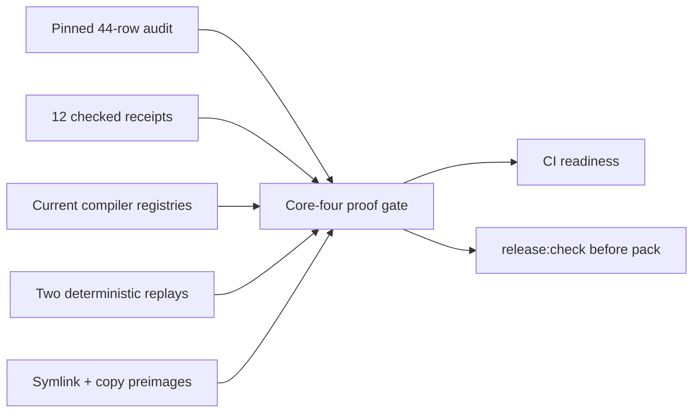

# PLUXX-329 Frozen Core-Four Release Gate - Plan

## Goal Capsule

Add one hermetic release gate for the frozen core-four orchestration proof.

## Product Contract

### Requirements

- R1. Gate the exact 44-row Compound Engineering, Hyperframes, and Superpowers revision, file digest, and executable inventory from one checked-in authority.
- R2. Gate all 12 fixture/host receipts for schema, identity, version, revision, inventory, registry, compiler, install ownership, evidence, freshness, and deterministic replay bindings.
- R3. Re-derive adjunct and orchestration outcomes plus maintained compatibility output from current registries; stale or contradictory output fails closed.
- R4. Enforce discovery `environment-unavailable` 12/12, activation `unsupported` 12/12, behavior `environment-unavailable` 12/12, and 324/324 degraded outcomes. Generated registration artifacts never satisfy stronger evidence stages.
- R5. Validate clean symlink-root and copied-install ownership preimages and reject tamper, collision, missing, stale, executable-mode, unsafe location, nested-link, retarget, and dangling-link cases.
- R6. Invoke the same non-mutating gate from CI and `release:check` before packaging, with no mutable external dependency or live machine state.
- R7. Preserve Phases 0-5, exclude all seven secondary hosts, synchronize maintained docs and Linear, and close only after two reviews and the full validation contract pass.

### Scope Boundaries

- Claude Code, Cursor, Codex, and OpenCode only.
- No real-host adapter, parity promotion, GitHub mutation, publish, release, tag, deploy, or live plugin/config mutation.
- External exact-source rehashing remains an optional audit producer; release readiness consumes checked-in hermetic truth.

## Planning Contract

### Key Technical Decisions

- KTD1. Put one `core-four:proof` command under `release:check` immediately after proof freshness and call the same command from CI. Do not wire repository fixture proof into user-plugin publish or `prepublishOnly`.
- KTD2. Extract pure validators and a shared replay runner so failure injection does not create parallel proof truth.
- KTD3. Extend install ownership with backward-compatible executable-bit evidence and bind symlink proof to the expected generated root and target bundle digest.
- KTD4. Compare maintained compatibility renderings in memory; the release gate never rewrites maintained output.

### High-Level Technical Design

## Implementation Units

### U1. Define fail-closed proof and ownership contracts

**Goal:** Validate the pinned portfolio, exact ceiling, receipt bindings, registry freshness, and ownership preimages through pure reusable functions.

**Requirements:** R1-R5, R7

**Files:** `src/core-four-release-proof.ts`, `src/install-ownership.ts`, `src/orchestration-runtime-proof.ts`, `tests/core-four-release-proof.test.ts`, `tests/install-ownership.test.ts`

**Approach:** Reuse canonical fixture/host registries and receipt validators. Add executable-bit ownership evidence compatibly, exact symlink target-root and bundle binding, copy-tree equality, and rejection of unsafe link shapes.

**Execution note:** Add adversarial tests first and observe focused failures before implementing behavior.

**Test scenarios:** clean 44-row/12-case proof; missing, duplicate, swapped, or stale identity and digest; ceiling promotion; registration evidence at a stronger stage; copy and symlink green preimages; content, collision, missing, stale, chmod, unsafe location, nested link, retarget, dangling, and kind-substitution negatives.

**Verification:** Pure gate and ownership tests pass with actionable diagnostics and no live state access.

### U2. Add the hermetic deterministic gate command

**Goal:** Replay the 12 cases twice in isolated homes, validate checked receipts and both ownership modes, and compare maintained compatibility output without writes.

**Requirements:** R2-R6

**Dependencies:** U1

**Files:** `scripts/check-core-four-release-proof.ts`, `scripts/run-orchestration-runtime-proof.ts`, `scripts/generate-compatibility-matrix.ts`, `tests/core-four-release-proof-cli.test.ts`, `tests/orchestration-installed-runtime-proof.test.ts`

**Approach:** Extract one shared runner; canonical symlink receipts remain checked in, while copied-install replay proves the alternate ownership preimage without creating a second maintained receipt portfolio.

**Execution note:** Start with a failing CLI integration contract and failure-injection cases, then implement the non-mutating coordinator.

**Test scenarios:** two identical 12-case replays; checked receipt byte drift; copied replay determinism; stale compatibility rendering; isolated environment allowlist; no network access.

**Verification:** The command reports exact counts and exits nonzero on every injected contradiction.

### U3. Wire release readiness and synchronize durable truth

**Goal:** Make the single gate authoritative in CI/release readiness and align maintained product, release, and initiative truth.

**Requirements:** R6-R7

**Dependencies:** U1-U2

**Approach:** Insert `core-four:proof` once in `release:check`, add the same CI step, document the frozen ceiling and residual real-host gap, and retain all secondary-host exclusions.

**Test scenarios:** package/workflow parsing proves gate ordering before packaging; stale-doc searches find no Phase 6-pending or all-host claim.

**Verification:** Maintained docs, workflow tests, and Linear describe the same Phase 0-6 release-readiness boundary.

## Verification Contract

Run focused proof-gate, receipt, source-audit, compatibility, ownership, verifier, publish-dry-run, and failure-injection tests; two deterministic 12-case replays; full tests; typecheck; build/declarations; built CLI lint/doctor; non-mutating release/publish gate invocation; generated compatibility; diff check; and privacy/network-dependence scans. Run CE multi-persona review and a fresh independent final reviewer, incorporate all valid P0-P2 findings, and rerun affected plus full gates.

## Definition of Done

- R1-R7 are satisfied with no unresolved P0-P2 findings.
- One hermetic gate owns release readiness for the 44-row inventory, 12 receipts, exact evidence ceiling, compatibility freshness, and both ownership preimages.
- Phase 0-5 behavior remains green, all secondary hosts remain excluded, and the branch is committed locally with Linear closeout evidence and an exact PR/release handoff.
