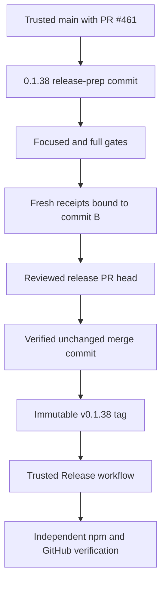

# PLUXX-340 Pluxx v0.1.38 Release

## Goal Capsule

Release and independently verify Pluxx 0.1.38 from trusted `origin/main` commit `b979bc6e02bb9801fa623f80302000553a0693c7`, which contains merged PR #461 and exact reviewed implementation head `b839f6d93ec1174c4da5dcfb1554c7c6f8f294d5`.

Product Contract unchanged.
This plan packages the reviewed PLUXX-340 manifest-identity fix and does not add new publish behavior.

---

## Product Contract

### Requirements

- R1. Package, lockfile, recovery default, proof manifest, and canonical release docs identify 0.1.38.
- R2. Release-prep proof uses fresh receipts bound to an exact reachable commit containing the 0.1.38 changes.
- R3. Released 0.1.37 proof remains historical and is not reused as current 0.1.38 evidence.
- R4. Focused and full gates cover manifest uniqueness, physical release assets, installer selection, proof freshness, packaged runtime, and dry-run packaging.
- R5. The release PR is reviewed on its exact head and merged only after every current check and review thread is green.
- R6. `v0.1.38` is created once from the exact trusted merge commit through the documented tag flow.
- R7. npm and GitHub release artifacts are independently verified against tag, commit, package version, contents, and SHA-256 identity.
- R8. PLUXX-340 and SendLens dependency truth stay current through public verification.

### Scope Boundaries

- Never move, recreate, or reuse an existing tag.
- Never publish from a local shell or weaken the trusted release workflow.
- No behavior change beyond merged PR #461.
- No unrelated cleanup or product work.

---

## Planning Contract

### Key Technical Decisions

- KTD1. Use two preparation commits because a Git commit cannot contain a receipt naming its own SHA.
  The first commit is the immutable release-prep tree that runs the claimed gates; the second records fresh receipts pointing to that exact reachable ancestor and reruns all gates.
- KTD2. Keep `releaseState` at `release-prep` until the tag exists, then update release truth after public verification in a separate closeout change if required by repository policy.
- KTD3. Use the trusted tag-triggered GitHub workflow for publication and independently compare npm and GitHub tarball hashes.
- KTD4. Treat any head change, failing check, current review finding, tag collision, workflow failure, or artifact mismatch as a release blocker.
- KTD5. Merge the receipt-bearing release PR with a true merge commit, never squash or rebase, then prove the exact PR head and receipt-bound commit are ancestors of trusted `main` before tagging.

### High-Level Technical Design

---

## Implementation Units

### U1. Release-prep truth

- **Goal:** Move maintained package, workflow, proof, planning, and release surfaces to 0.1.38.
- **Requirements:** R1, R2, R3, R8.
- **Dependencies:** None.
- **Files:** `package.json`, `package-lock.json`, `.github/workflows/release.yml`, `tests/release-workflow.test.ts`, `docs/proof-manifest.json`, `docs/start-here.md`, `docs/proof-freshness.md`, `docs/proof-and-install.md`, `docs/release-distribution-proof-map.md`, `docs/releasing-pluxx.md`, `docs/roadmap.md`, `docs/todo/queue.md`, `docs/todo/master-backlog.md`.
- **Approach:** Preserve 0.1.37 as historical, set 0.1.38 to release-prep, and keep consumer readiness false.
- **Test scenarios:** Package and manifest mismatch fails; workflow default and tests agree; canonical docs contain no obsolete non-historical claim.
- **Verification:** Focused proof, workflow, publish, smoke, and packaged-runtime tests pass.

### U2. Immutable proof commit and receipts

- **Goal:** Bind fresh 0.1.38 proof to the exact release-prep tree.
- **Requirements:** R2, R3, R4.
- **Dependencies:** U1.
- **Files:** U1 files plus `docs/proof-receipts/v0.1.38-repository-validation.json` and `docs/proof-receipts/v0.1.38-fake-home-install.json`.
- **Approach:** Commit and gate U1, then record only observed passing commands against that SHA and rerun the complete release gate.
- **Test scenarios:** Missing, unreachable, mismatched-version, stale, or non-passing current receipts fail closed.
- **Verification:** Both receipts point to the reachable 0.1.38 commit and all final-tree gates pass.

### U3. Review, PR, and trusted release

- **Goal:** Review, merge, tag, publish, and verify the exact unchanged release.
- **Requirements:** R5, R6, R7, R8.
- **Dependencies:** U2.
- **Files:** `docs/orchid/reviews/2026-07-25-pluxx-340-release-0.1.38-review.md`, Linear comments, PR description, GitHub release evidence.
- **Approach:** Run independent reviews, open an autofix-enabled PR, babysit exact-head CI and threads, merge the verified head, create the tag once from the trusted merge commit, monitor the Release workflow, and compare public artifacts independently.
- **Test scenarios:** Head changes invalidate prior settledness; tag collision stops release; workflow failure stops verification; any public identity mismatch fails closeout.
- **Verification:** PR, merge, tag, workflow run, npm package, GitHub release asset, and checksums all resolve to the same 0.1.38 release identity.

### U4. Immutable-tag recovery after action-time fixture collision

- **Goal:** Preserve the immutable tag and recover publication after the first tag-triggered run failed closed before pack or publish.
- **Trigger:** Release run `30152484521` exposed a test fixture that cloned the now-tagged repository with tags and then tried to create `v0.1.38` again.
- **Files:** `scripts/release-recovery-proof.mjs`, `tests/release-recovery-proof.test.ts`, proof/planning docs, Linear comments, and the release review record.
- **Approach:** Keep `v0.1.38` fixed at trusted merge `e24d4db3f57fa0942376237fb212cb49368d7704`; make the fixture clone tagless; make recovery run the exact immutable test tree from a tagless clone at the same commit; merge the independently reviewed fix to exact current main; dispatch the documented recovery workflow from that trusted main commit.
- **Test scenarios:** A release-recovery fixture must pass both before and after the real version tag exists; the tagless recovery test checkout must resolve to the exact immutable release commit; any commit drift, test failure, artifact mismatch, or tag movement fails closed.
- **Verification:** Focused recovery tests and the full release gate pass on trusted main, recovery run succeeds, and independently downloaded npm/GitHub artifacts are byte-identical and provenance-bound to the unchanged tag.

---

## Verification Contract

| Gate | Done signal |
|---|---|
| Fail-first package/proof mismatch | Fails for the expected version mismatch |
| Focused suites | Proof freshness, release workflow, publish, release smoke, and packaged runtime pass |
| `npm run build` and `npm run typecheck` | Both pass |
| `npm test` | Full serial suite passes |
| `npm run release:check` | Complete release gate passes |
| Independent CE review | No unresolved actionable finding |
| Exact-head GitHub checks | Required checks and current review threads are green |
| Trusted release workflow | Tag-triggered Release run succeeds |
| Public artifact verification | npm and GitHub tarballs are byte-identical and bound to the immutable tag |

---

## Definition of Done

- Package, workflow, proof, planning, and release docs agree on 0.1.38.
- Fresh receipts bind to the exact immutable release-prep commit; 0.1.37 remains historical.
- Local focused/full gates and independent reviews are green.
- The exact reviewed PR head is merged without replacement.
- `v0.1.38` exists once at the trusted merge commit and the Release workflow succeeds.
- npm and GitHub serve the verified 0.1.38 artifact with matching SHA-256.
- PLUXX-340 and SendLens dependency truth contain exact PR, merge, tag, run, and artifact evidence.
