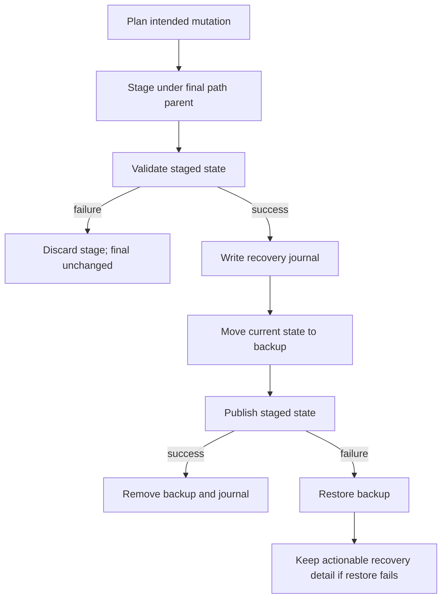

# fix: Make authoring and build mutations atomic

## Goal Capsule

- **Objective:** Make `init`, `sync`, `migrate`, and `build` publish only fully staged and validated mutations while preserving existing source and distribution state on failure.
- **Authority:** PLUXX-318 acceptance criteria, then repo `AGENTS.md`, then current CLI compatibility and local implementation patterns.
- **Execution profile:** Reliability-first implementation with injected-failure coverage before closeout.
- **Stop condition:** Stop rather than weakening atomicity if a platform cannot provide the required replace/rollback guarantees; document a precise bound instead.
- **Tail ownership:** The PLUXX-318 branch owns implementation, tests, docs, PR/CI repair, and Linear closeout without merging.

---

## Product Contract

### Summary

Authoring and build commands must separate planning from mutation. Each command stages its complete intended result, validates that staged state, publishes it as one recoverable transaction, and reports the same create/update/delete/conflict truth in dry-run and apply modes.

### Problem Frame

The current paths write final files or delete final output before the full operation is known to succeed. A generator, copy, lint, rename, or filesystem failure can therefore leave a source project or `dist` tree only partly updated. Existing dry-run behavior is also inconsistent: init and sync expose partial summaries, migrate has no manifest, and ambiguous sync renames are not a first-class conflict.

### Requirements

- R1. A shared transaction layer stages planned filesystem changes, validates them, and either applies all changes or restores the exact pre-operation state.
- R2. `build` generates into a same-filesystem staging directory and publishes the completed output only after bundle validation succeeds.
- R3. `init`, `sync`, and `migrate` expose deterministic manifests covering creates, updates, deletes, renames, and conflicts as applicable.
- R4. Injected failures during staging, validation, or publication leave original source and distribution paths intact.
- R5. Sync preserves user/custom content and refuses ambiguous rename/collision plans instead of guessing.
- R6. Cross-device replacement is avoided by same-parent staging; unsupported rename behavior is recovered through backup-and-restore and surfaced clearly.
- R7. Interrupted apply phases leave actionable recovery metadata until publication completes or rollback succeeds.
- R8. Existing CLI JSON fields remain compatible; new manifest and recovery fields are additive.

### Scope Boundaries

In scope are the four PLUXX-318 mutation paths and their shared filesystem transaction seam. Install, publish, upgrade, Codex companion ownership, and broader release recovery remain owned by sibling audit issues.

### Acceptance Examples

- AE1. Given an existing `dist`, when a generator or bundle validator fails, then every byte under the existing `dist` remains unchanged.
- AE2. Given an existing MCP-authored project, when sync fails after staging or during publication, then managed files, custom sections, and saved agent artifacts match their pre-sync state.
- AE3. Given two equally plausible tool renames, when sync is planned, then dry-run reports a conflict and apply refuses to mutate.
- AE4. Given a migration or init dry-run, then the reported manifest matches the subsequent successful apply without writing final paths.
- AE5. Given a publication rename failure, then the backup is restored and the error names the recovery state or location.

---

## Planning Contract

### Key Technical Decisions

- KTD1. Use same-parent temporary directories for directory publication so staging and final output are on the same filesystem by construction.
- KTD2. Use a backup-then-rename directory publish sequence with immediate restoration on failure; never delete the original before the replacement is ready.
- KTD3. Represent source mutations as an ordered manifest and apply them through one rollback-capable file transaction rather than letting command-specific loops write final paths.
- KTD4. Keep recovery journals outside the user-authored payload but adjacent enough to make interrupted operations diagnosable; remove them only after commit or successful rollback.
- KTD5. Preserve current top-level JSON summary fields and add a versioned `mutation` object for richer creates/updates/deletes/renames/conflicts/recovery truth.
- KTD6. Treat multiple high-confidence rename candidates or destination collisions as conflicts requiring user resolution, not as heuristic winners.

### High-Level Technical Design

### Assumptions

- Node 18 filesystem primitives are the compatibility floor.
- Full process-crash recovery can be made actionable through a durable journal and backup location, while normal thrown failures are rolled back automatically.
- Existing command summaries are consumed externally, so compatibility is additive rather than a wholesale schema replacement.

### Sequencing

Build the shared transaction seam first, integrate directory publication for build, then source-file transactions for init/sync/migrate, and finally align CLI manifests and docs.

---

## Implementation Units

### U1. Shared filesystem transaction and recovery contract

- **Goal:** Provide reusable staged directory publication, file-manifest application, rollback, recovery journaling, and failure-injection seams.
- **Requirements:** R1, R4, R6, R7.
- **Dependencies:** None.
- **Files:** `src/fs-transaction.ts`, `tests/fs-transaction.test.ts`.
- **Approach:** Stage beside the destination, validate before commit, move existing state to a unique backup, publish by rename, restore on any thrown publish error, and retain a versioned journal only when automatic recovery cannot finish.
- **Execution note:** Start with failure tests for pre-publish, post-backup, and restore paths.
- **Patterns to follow:** Conservative path validation in `src/generators/index.ts`; plan/apply separation in `src/cli/agent.ts` and `src/cli/codex-apply.ts`.
- **Test scenarios:** New destination publish; existing destination replacement; validation failure; failure after backup move; rollback failure retaining journal; same-parent staging guarantee; no stale temporary state after success.
- **Verification:** The helper proves exact before/after trees and recovery metadata under injected failures.

### U2. Atomic staged build publication

- **Goal:** Keep existing `dist` untouched until every selected generator and bundle validation succeeds.
- **Requirements:** R2, R4, R6, R8; AE1, AE5.
- **Dependencies:** U1.
- **Files:** `src/generators/index.ts`, `tests/build.test.ts`, `tests/build-cli.test.ts`.
- **Approach:** Generate against a staging `outDir`, validate that staged tree using the existing bundle checker, then publish it through U1. Preserve `clean: false` semantics by seeding the stage from current output.
- **Execution note:** Add characterization for selected targets and `clean: false` before changing publication.
- **Patterns to follow:** Existing generator fan-out and `assertGeneratedBundlesCurrent` validation.
- **Test scenarios:** Generator failure preserves prior dist; validator failure preserves prior dist; successful build replaces stale files; selected targets and clean behavior remain compatible; publication failure restores prior dist.
- **Verification:** Targeted build suites pass and byte-level tree snapshots prove failure atomicity.

### U3. Atomic init and sync manifests

- **Goal:** Apply scaffold and refresh mutations through staged validation and one rollback-capable manifest while preserving custom content and refusing ambiguous renames.
- **Requirements:** R1, R3, R4, R5, R7, R8; AE2, AE3, AE4.
- **Dependencies:** U1.
- **Files:** `src/cli/init-from-mcp.ts`, `src/cli/sync-from-mcp.ts`, `src/cli/index.ts`, `tests/init-from-mcp.test.ts`, `tests/sync-from-mcp.test.ts`, `tests/cli-phase2.test.ts`, `tests/cli-init-json.test.ts`, `tests/cli-sync.test.ts`.
- **Approach:** Extend scaffold plans with deletes/conflicts where relevant, validate the staged project before final apply, apply through U1, and share one additive mutation-summary shape between dry-run and apply. Detect rename ties and occupied destinations before any final write.
- **Execution note:** Preserve current JSON keys exactly and test new fields as additive.
- **Patterns to follow:** Existing `planMcpScaffold`, mixed-content markers, managed-file metadata, and sync dry-run clone.
- **Test scenarios:** Mid-write failure rollback; lint/validation failure before apply; dry-run/apply manifest parity; custom-section preservation; delete/rename reporting; ambiguous rename refusal; collision with user-owned destination; saved-agent invalidation rollback.
- **Verification:** Init/sync targeted suites prove both compatibility and exact failure-state preservation.

### U4. Atomic migrate planning and apply

- **Goal:** Give migrate a dry-run/conflict manifest and prevent partial canonical projects when parsing, copying, sanitizing, or metadata generation fails.
- **Requirements:** R1, R3, R4, R5, R7, R8; AE4, AE5.
- **Dependencies:** U1.
- **Files:** `src/cli/migrate.ts`, `src/cli/index.ts`, `tests/migrate.test.ts`.
- **Approach:** Split migrate into plan/stage and apply phases, record every destination action, surface occupied-path conflicts conservatively, validate staged config/metadata, then publish the manifest through U1.
- **Execution note:** Characterize existing migration output before extraction because this module carries many host-specific preservation rules.
- **Patterns to follow:** Current detection/parsing helpers and existing migration fixture matrix.
- **Test scenarios:** Dry-run writes nothing; dry-run/apply parity; config collision; nested destination collision; injected copy/sanitize/metadata failure; publication rollback; current host-specific migration fixtures remain unchanged.
- **Verification:** The migrate suite passes with new transaction cases and rebuilt migrated output remains loadable/buildable.

### U5. CLI/docs truth and recovery guidance

- **Goal:** Keep public command contracts, planning truth, and recovery instructions aligned with the shipped behavior.
- **Requirements:** R3, R7, R8.
- **Dependencies:** U2, U3, U4.
- **Files:** `src/cli/index.ts`, `docs/start-here.md`, `docs/todo/queue.md`, `docs/todo/master-backlog.md`, `docs/roadmap.md`.
- **Approach:** Document atomic authoring/build guarantees and explicit interruption bounds; update only current-truth sections and avoid unrelated roadmap reprioritization.
- **Test scenarios:** CLI JSON snapshots/expectations retain existing fields and include the versioned additive mutation object; human output names conflicts and recovery actions.
- **Verification:** Docs agree with tested behavior and Linear closeout links the plan, PR, validation, and residual risks.

---

## Verification Contract

| Gate | Coverage | Done signal |
|---|---|---|
| Atomic helper tests | U1 | Failure phases restore exact original trees and success leaves no recovery residue. |
| Build tests | U2 | Generator, validation, and publication failures preserve prior `dist`; normal output remains compatible. |
| Init/sync/migrate tests | U3, U4 | Dry-run parity, conflicts, custom preservation, and rollback scenarios pass. |
| `npm run typecheck` | U1-U5 | No TypeScript errors. |
| `npm run build` | U1-U5 | Runtime bundle and declarations build successfully. |
| Serial `npm test` | U1-U5 | Full official suite passes under the worktree lock with no concurrent fixture-heavy run. |
| CE reliability and code review | U1-U5 | All actionable findings are fixed and validation reruns green. |

---

## Definition of Done

- All four PLUXX-318 command paths stage before publishing and preserve original final paths on injected failure.
- Dry-run manifests accurately predict apply actions and surface conflicts without writing.
- Ambiguous renames and destination collisions never silently overwrite user content.
- Existing JSON summaries remain compatible with additive versioned mutation detail.
- Cross-device behavior is avoided or explicitly bounded, and interrupted-operation recovery information is actionable.
- Targeted suites, typecheck, build, and the full serial `npm test` pass.
- Repo docs and PLUXX-318/PLUXX-312 Linear truth are updated.
- A focused PR is pushed, linked, labeled `ai:autofix-enabled`, and has green CI with actionable review feedback resolved.
