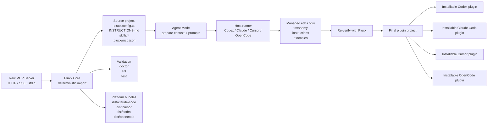
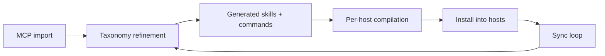

# Pluxx Architecture

This document is the working architecture view for Pluxx. It is meant to be edited as the product evolves.

If you want the tighter scope boundary for which extension-system primitives Pluxx should treat as core, read [Core primitives](/overview/core-primitives).

## Core Model

Pluxx has two intentional layers:

- `Core`: deterministic import, scaffold, lint, build, install, and sync
- `Agent`: context packs and prompt packs that let Codex, Claude Code, Cursor, or OpenCode refine the scaffold safely

The important product split is:

- users bring a raw MCP
- Pluxx turns it into a maintainable plugin project
- a host coding agent can improve the generated meaning without owning the structure

## System Diagram



## Concise Pipeline Diagram



## What Each Layer Owns

### Core

Core is responsible for things that should be deterministic and reviewable:

- MCP transport and auth parsing
- tool discovery
- config generation
- baseline skills and instructions
- hooks and scripts scaffolding
- cross-platform build output
- lint, doctor, install, sync
- ownership boundaries between generated and custom content

### Agent

Agent Mode is responsible for semantic refinement, not system truth:

- better skill grouping
- better skill titles and descriptions
- better generated examples
- better shared instructions
- product-shape review of the scaffold

Agent Mode does not replace Core. It improves Core's first pass.

## Two Different Kinds Of Targets

This distinction is important.

### Plugin output targets

These are the platforms Pluxx generates bundles for:

- `claude-code`
- `cursor`
- `codex`
- `opencode`

These control what gets written under `dist/`.

### Agent runner target

This is the coding agent driving refinement:

- `claude`
- `cursor`
- `codex`
- `opencode`

These control who executes `pluxx agent run ...`.

That means `codex` can be:

- a plugin output target
- an agent runner
- or both at once

## Generated Source Project

The source project is the thing users maintain over time.

```text
my-plugin/
├── pluxx.config.ts
├── INSTRUCTIONS.md
├── .pluxx/
│   └── mcp.json
├── scripts/
│   └── check-env.sh
├── skills/
│   ├── skill-a/
│   │   └── SKILL.md
│   └── skill-b/
│       └── SKILL.md
└── dist/
    ├── claude-code/
    ├── cursor/
    ├── codex/
    └── opencode/
```

## File Ownership Model

Generated markdown files use mixed ownership:

- `<!-- pluxx:generated:start --> ... <!-- pluxx:generated:end -->`
- `<!-- pluxx:custom:start --> ... <!-- pluxx:custom:end -->`

Rules:

- Pluxx and host agents may rewrite generated sections
- users own custom sections
- `pluxx sync --from-mcp` preserves custom sections

## Agent Pack

Agent Mode writes:

```text
.pluxx/
└── agent/
    ├── context.md
    ├── plan.json
    ├── taxonomy-prompt.md
    ├── instructions-prompt.md
    └── review-prompt.md
```

Purpose:

- `context.md`: semantic handoff for the host agent
- `plan.json`: write boundaries and acceptance criteria
- prompt files: focused tasks for taxonomy, instructions, and review

## Operational Flow

```text
Raw MCP
  -> pluxx init --from-mcp
  -> pluxx doctor / lint / test
  -> optional pluxx agent prepare
  -> optional pluxx agent run taxonomy|instructions|review
  -> pluxx build
  -> pluxx install
  -> later pluxx sync --from-mcp
```

## Current Product Position

Pluxx is not a destination app. It is:

- a plugin authoring substrate
- a cross-platform packaging layer
- a maintenance layer for MCP-backed plugins
- increasingly something people use through Codex and Claude Code

## Open Questions

- How much of the default first-run flow should live behind `pluxx autopilot` versus remain manual and explicit?
- How opinionated should the shipped `pluxx.agent.md` override format become before it turns into another config system?
- How much semantic understanding should stay in host agents vs move into Pluxx heuristics?
